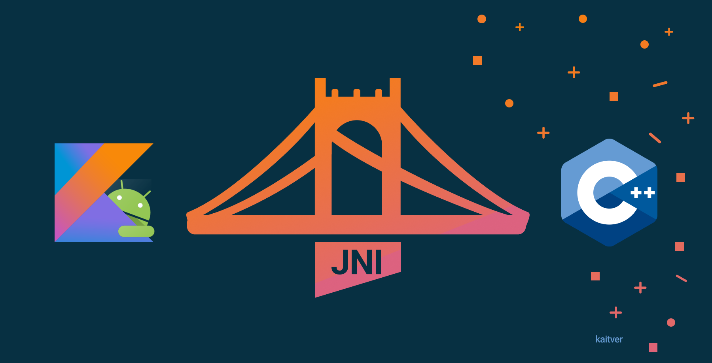

## Brooklyn Bridge

[](https://github.com/klee0kai/brooklyn_bridge/actions/workflows/deploy_dev.yml)
[](./LICENSE)
[](https://jitpack.io/#klee0kai/brooklyn_bridge)

Kotlin bridge to C++ over jni.



## Quick Start 

This project runs as a gradle plugin. 
First of all you need to download the dependencies for the build system.
In the root project `build.gradle.kts` specify the dependency.

```kotlin
buildscript {
    repositories {
        gradlePluginPortal()
        google()
        maven(url = "https://jitpack.io")
    }
    dependencies {
        classpath("com.github.klee0kai.brooklyn:brooklyn-plugin:0.0.1")
    }
}
```

In the module `build.gradle.kts`, specify the plugin, configure the parameters if necessary

```kotlin
plugins {
    id("brooklyn-plugin")
}

brooklyn {
    // params
}
```

The plugin will generate models for a C++ project. Use annotations `@JniMirror` and `@JniPojo`.
To include cpp generated files, pull them into cmake.

We pull up the Smak library in accordance with the source code set used.
For source set `main` use `../../../build/generated/sources/main/brooklyn/FindBrooklynBridge.cmake`.

```
get_filename_component(BROOKLYN_FILE
        ../../../build/generated/sources/main/brooklyn/FindBrooklynBridge.cmake
        ABSOLUTE)
if (EXISTS ${BROOKLYN_FILE})
    include(${BROOKLYN_FILE})
endif ()


add_library(${CMAKE_PROJECT_NAME} SHARED  native-lib.cpp
        ${BROOKLYN_SRC}
        )

target_include_directories(${CMAKE_PROJECT_NAME}
        PUBLIC
        ${BROOKLYN_INCLUDE_DIRS}
        )
```

If you are building an android project, correct the task sequence

```kotlin
afterEvaluate {
    val kotlinCompileTasks = tasks.filterIsInstance<JavaCompile>()
    val cmakeTasks =
        (tasks.filterIsInstance<com.android.build.gradle.tasks.ExternalNativeBuildTask>() +
                tasks.filterIsInstance<com.android.build.gradle.tasks.ExternalNativeBuildJsonTask>()
                )

    cmakeTasks.forEach { cmakeTask ->
        kotlinCompileTasks.forEach { kotlinTask ->
            cmakeTask.mustRunAfter(kotlinTask)
        }
    }
}
```


## Generating files 

 - Generated folder 
   - mappers - index jni methods and classes 
   - model - model mirrors and jni class interfaces
   - mirror - cpp class mirrors, which works via jvm
   - brooklyn.h - common import file
   - env.h/env.cpp - multithread support 
   - cmake file - import lib cmake file 
 
Name spaces 
 - brooklyn::mapper - jni class mapper and index
 - brooklyn - models 

## Similar Projects

- [HawtJNI](https://github.com/fusesource/hawtjni) - Implementing JNI libraries is a piece of cake when you use HawtJNI

## License

```
Copyright (c) 2023 Andrey Kuzubov
```

